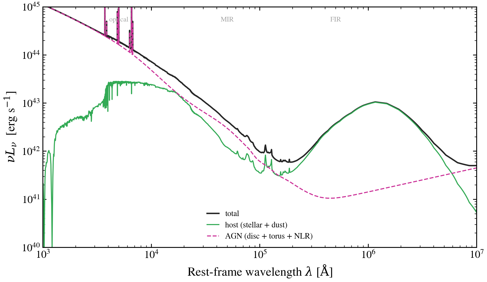

.. DO NOT EDIT.
.. THIS FILE WAS AUTOMATICALLY GENERATED BY SPHINX-GALLERY.
.. TO MAKE CHANGES, EDIT THE SOURCE PYTHON FILE:
.. "auto_examples/workflows/plot_workflow_agn_host_decomposition.py"
.. LINE NUMBERS ARE GIVEN BELOW.

.. only:: html

    .. note::
        :class: sphx-glr-download-link-note

        :ref:`Go to the end <sphx_glr_download_auto_examples_workflows_plot_workflow_agn_host_decomposition.py>`
        to download the full example code.

.. rst-class:: sphx-glr-example-title

.. _sphx_glr_auto_examples_workflows_plot_workflow_agn_host_decomposition.py:

AGN + host decomposition: panchromatic SED with each component peeled off
============================================================================

Builds a star-forming host with a moderate-luminosity AGN
(``log L_bol = 12``) at z = 0.1 and shows the full panchromatic SED
alongside each block's individual contribution. Stellar + nebular +
dust gives a typical SF galaxy; adding the composable AGN's disc and
torus pushes the SED up by ~1 dex in the optical/UV and adds a clear
mid-IR torus bump on top of the stellar+dust IR.

The figure makes obvious how observers separate AGN from host:
- *Optical/UV*: AGN disc continuum overshoots the stellar blue end
- *Near-IR*: ambiguous (both host stellar tail and AGN tail dominate)
- *Mid-IR*: torus bump is the cleanest AGN signature

.. GENERATED FROM PYTHON SOURCE LINES 17-79

.. code-block:: Python

    import warnings

    import jax
    import matplotlib.pyplot as plt
    import numpy as np

    import tengri
    from tengri.analysis.plotting import setup_style

    setup_style()
    warnings.filterwarnings("ignore", message=".*BakedInBackend.*")

    C_AA_PER_S = 2.998e18
    SSP = tengri.load_ssp("fsps_prsc_miles_chabrier")
    COMMON = dict(
        sfh={"type": "dpl", "*": tengri.FIXED, "tau_gyr": 1.0,
             "log_peak_sfr": 1.0, "alpha": 2.0, "beta": 2.5},
        dust={"type": "two_component", "*": tengri.FIXED,
              "tau_diff": 0.3, "tau_bc": 0.5,
              "emission": {"type": "dale2014", "*": tengri.FIXED}},
        redshift=tengri.Fixed(0.1),
    )
    AGN_BLOCK = {"disc":  {"type": "multicolor", "*": tengri.FIXED},
                 "torus": {"type": "skirtor",    "*": tengri.FIXED},
                 "lines": {"type": "nlr",        "*": tengri.FIXED},
                 "*": tengri.FIXED, "log_lbol": 12.0, "frac": 1.0}

    def _nuLnu(with_agn):
        kw = dict(COMMON)
        if with_agn:
            kw["agn"] = AGN_BLOCK
        model = tengri.SEDModel.build(SSP, **kw)
        p = dict(model.spec.sample(jax.random.PRNGKey(0)))
        out = model.predict_rest_sed(p)
        wave = np.asarray(out.wavelength)
        return wave, C_AA_PER_S / wave * np.asarray(out.sed)

    wave, nuL_host = _nuLnu(with_agn=False)
    _, nuL_total = _nuLnu(with_agn=True)
    nuL_agn = np.where(nuL_total > nuL_host, nuL_total - nuL_host, np.nan)

    fig, ax = plt.subplots(figsize=(8.0, 4.8))
    ax.loglog(wave, nuL_total, color="0.15", lw=1.6, label="total")
    ax.loglog(wave, nuL_host, color="#33aa55", lw=1.2, label="host (stellar + dust)")
    ax.loglog(wave, nuL_agn, color="#cc3399", lw=1.2, ls="--",
              label="AGN (disc + torus + NLR)")

    for um, name in [(0.5, "optical"), (5, "MIR"), (50, "FIR")]:
        ax.text(um * 1.0e4, 5e44, name, fontsize=8, color="0.5",
                ha="center", alpha=0.7)

    ax.set(xlim=(1e3, 1e7), ylim=(1e40, 1e45),
           xlabel=r"Rest-frame wavelength $\lambda$ [$\mathrm{\AA}$]",
           ylabel=r"$\nu L_\nu$  [erg s$^{-1}$]")
    ax.legend(frameon=False, fontsize=9, loc="lower center")

    fig.tight_layout()
    plt.savefig("plot_workflow_agn_host_decomposition.png", dpi=150,
                bbox_inches="tight")

.. _sphx_glr_download_auto_examples_workflows_plot_workflow_agn_host_decomposition.py:

.. only:: html

  .. container:: sphx-glr-footer sphx-glr-footer-example

    .. container:: sphx-glr-download sphx-glr-download-jupyter

      :download:`Download Jupyter notebook: plot_workflow_agn_host_decomposition.ipynb <plot_workflow_agn_host_decomposition.ipynb>`

    .. container:: sphx-glr-download sphx-glr-download-python

      :download:`Download Python source code: plot_workflow_agn_host_decomposition.py <plot_workflow_agn_host_decomposition.py>`

    .. container:: sphx-glr-download sphx-glr-download-zip

      :download:`Download zipped: plot_workflow_agn_host_decomposition.zip <plot_workflow_agn_host_decomposition.zip>`

.. only:: html

 .. rst-class:: sphx-glr-signature

    `Gallery generated by Sphinx-Gallery <https://sphinx-gallery.github.io>`_
