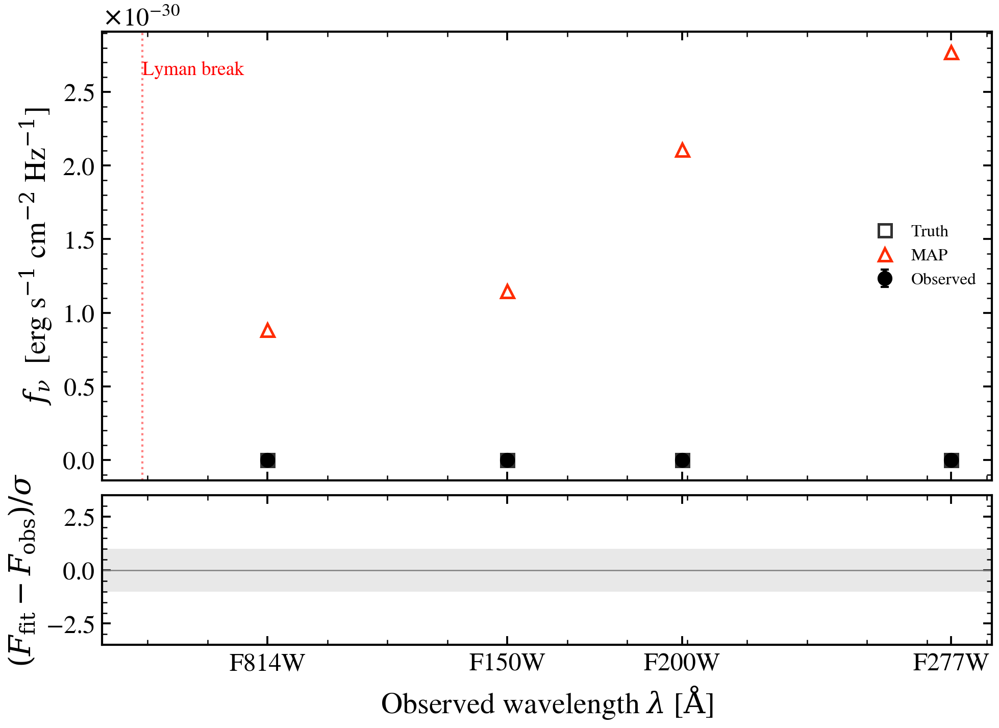

.. DO NOT EDIT.
.. THIS FILE WAS AUTOMATICALLY GENERATED BY SPHINX-GALLERY.
.. TO MAKE CHANGES, EDIT THE SOURCE PYTHON FILE:
.. "auto_examples/workflows/plot_workflow_high_z_lbg.py"
.. LINE NUMBERS ARE GIVEN BELOW.

.. only:: html

    .. note::
        :class: sphx-glr-download-link-note

        :ref:`Go to the end <sphx_glr_download_auto_examples_workflows_plot_workflow_high_z_lbg.py>`
        to download the full example code.

.. rst-class:: sphx-glr-example-title

.. _sphx_glr_auto_examples_workflows_plot_workflow_high_z_lbg.py:

Workflow: High-z Lyman-Break Galaxy
=====================================

Demonstrates fitting a z=4 Lyman-break galaxy with JWST/HST photometry.
A young, dust-free star-forming galaxy's SED shows a sharp UV dropout.
This workflow shows how to recover age, dust, and redshift from
the characteristic Lyman-break signature in broadband colors.

.. sphx-glr-precomputed-img:

.. GENERATED FROM PYTHON SOURCE LINES 17-143

.. code-block:: Python

    import jax
    import matplotlib.pyplot as plt
    import numpy as np

    from tengri import (
        Fitter,
        Fixed,
        Observation,
        Parameters,
        Photometry,
        SEDModel,
        Uniform,
        data_path,
        load_ssp,
    )
    from tengri.analysis.plotting import setup_style

    setup_style()

    # --- SSP data ---

    ssp = load_ssp()

    # --- Model: z=4 Lyman-break galaxy ---
    # JWST filters: F150W (1.5um), F200W (2.0um), F277W (2.77um)
    # HST filters: ACS-F814W (0.814um) should show dropout
    z_true = 4.0

    spec = Parameters(
        sfh_tsnorm_log_peak_sfr=Uniform(-1.0, 2.5),
        sfh_tsnorm_peak_lbt_gyr=Uniform(0.1, 2.0),  # Very young, recent peak
        sfh_tsnorm_width_gyr=Uniform(0.05, 1.0),
        sfh_tsnorm_skew=Fixed(0.5),  # Recent star formation
        sfh_tsnorm_trunc=Fixed(3.0),
        met_logzsol=Uniform(-2.0, 0.0),
        dust_tau_bc=Uniform(0.0, 0.5),  # Low dust (young, dust-free)
        dust_tau_diff=Fixed(0.0),  # Minimal diffuse dust
        dust_slope=Fixed(-0.7),
        redshift=Fixed(z_true),
        mean_sfh_type="tsnorm",
    )

    # Use synthetic filters: F814W for HST, NIR for JWST
    bands = ["hst_f814w", "jwst_f150w", "jwst_f200w", "jwst_f277w"]
    obs = Observation(photometry=Photometry.from_names(bands, cache_dir=str(data_path("filters"))))
    model = SEDModel(spec, ssp, observation=obs)

    # --- Generate mock photometry ---
    key = jax.random.PRNGKey(42)
    true_params = spec.sample(key)
    true_params["sfh_tsnorm_peak_lbt_gyr"] = 0.3  # 300 Myr old
    true_params["sfh_tsnorm_width_gyr"] = 0.2
    true_params["sfh_tsnorm_log_peak_sfr"] = 1.2
    true_params["met_logzsol"] = -0.5
    true_params["dust_tau_bc"] = 0.1
    mock = model.mock(true_params, snr=15.0, key=key)

    # --- Fit with MAP ---
    fitter = Fitter(model, data=mock.flux_obs, noise=mock.noise)
    posterior = fitter.run("map", optimizer="adam", n_steps=400, verbose=False)

    # --- Plot: SED with dropout signature ---
    fig, (ax, ax_res) = plt.subplots(
        2, 1, figsize=(8, 5), height_ratios=[3, 1], sharex=True, gridspec_kw={"hspace": 0.05}
    )

    # Observed-frame wavelengths
    wave_obs_eff = np.array([8140, 15000, 20000, 27700])
    band_labels = ["F814W", "F150W", "F200W", "F277W"]

    ax.errorbar(
        wave_obs_eff,
        np.array(mock.flux_obs),
        yerr=np.array(mock.noise),
        fmt="o",
        color="k",
        ms=7,
        capsize=3,
        label="Observed (z=4 LBG)",
    )
    ax.plot(
        wave_obs_eff,
        np.array(mock.flux_true),
        "s",
        color="C0",
        ms=7,
        mfc="none",
        lw=1.5,
        label="Truth",
    )
    ax.plot(
        wave_obs_eff,
        np.array(model.predict_photometry(posterior.params)),
        "^",
        color="C3",
        ms=7,
        mfc="none",
        lw=1.5,
        label="MAP fit",
    )

    # Highlight Lyman break: rest-frame 912 A → observed 4350 A
    ax.axvline(912 * (1 + z_true), color="red", ls=":", lw=1, alpha=0.5)
    ax.text(912 * (1 + z_true), ax.get_ylim()[1] * 0.92, "Lyman break", fontsize=9, color="red")

    ax.set_ylabel(r"$f_\nu$ [erg/s/cm$^2$/Hz]", fontsize=11)
    ax.legend(fontsize=10, frameon=False, loc="upper right")
    ax.set_title(f"High-z Lyman-Break Galaxy (z={z_true}): JWST+HST photometry", fontsize=12)

    pred_phot = model.predict_photometry(posterior.params)
    residuals = (np.array(mock.flux_obs) - np.array(pred_phot)) / np.array(mock.noise)
    ax_res.axhline(0, color="0.5", ls="--", lw=0.8)
    ax_res.scatter(wave_obs_eff, residuals, c="C3", s=40, zorder=5)
    ax_res.set_xlabel(r"Observed Wavelength [$\AA$]", fontsize=11)
    ax_res.set_ylabel(r"Residual [$\sigma$]")
    ax_res.set_xticks(wave_obs_eff)
    ax_res.set_xticklabels(band_labels)
    ax_res.set_ylim(-4, 4)

    fig.tight_layout()
    plt.savefig("plot_workflow_high_z_lbg.png", dpi=150, bbox_inches="tight")
    plt.show()

.. _sphx_glr_download_auto_examples_workflows_plot_workflow_high_z_lbg.py:

.. only:: html

  .. container:: sphx-glr-footer sphx-glr-footer-example

    .. container:: sphx-glr-download sphx-glr-download-jupyter

      :download:`Download Jupyter notebook: plot_workflow_high_z_lbg.ipynb <plot_workflow_high_z_lbg.ipynb>`

    .. container:: sphx-glr-download sphx-glr-download-python

      :download:`Download Python source code: plot_workflow_high_z_lbg.py <plot_workflow_high_z_lbg.py>`

    .. container:: sphx-glr-download sphx-glr-download-zip

      :download:`Download zipped: plot_workflow_high_z_lbg.zip <plot_workflow_high_z_lbg.zip>`

.. only:: html

 .. rst-class:: sphx-glr-signature

    `Gallery generated by Sphinx-Gallery <https://sphinx-gallery.github.io>`_
