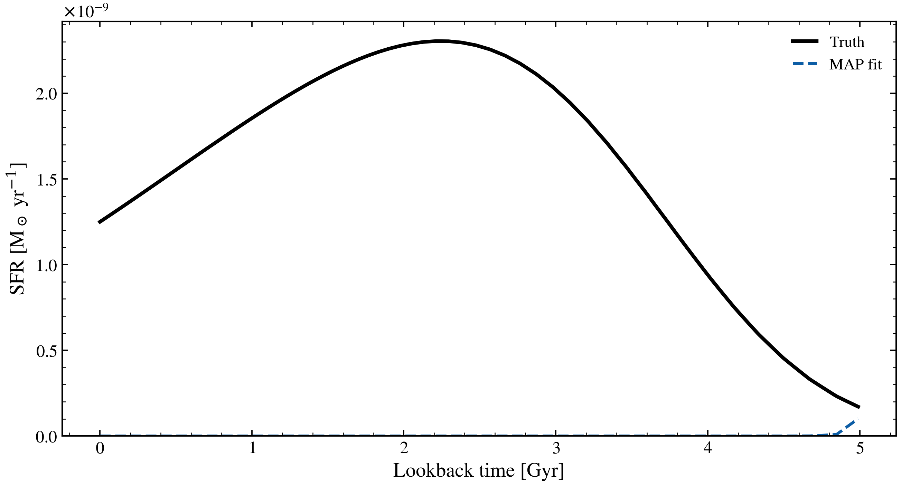

.. DO NOT EDIT.
.. THIS FILE WAS AUTOMATICALLY GENERATED BY SPHINX-GALLERY.
.. TO MAKE CHANGES, EDIT THE SOURCE PYTHON FILE:
.. "auto_examples/workflows/plot_workflow_method_comparison.py"
.. LINE NUMBERS ARE GIVEN BELOW.

.. only:: html

    .. note::
        :class: sphx-glr-download-link-note

        :ref:`Go to the end <sphx_glr_download_auto_examples_workflows_plot_workflow_method_comparison.py>`
        to download the full example code.

.. rst-class:: sphx-glr-example-title

.. _sphx_glr_auto_examples_workflows_plot_workflow_method_comparison.py:

Workflow: Inference Method Comparison
======================================

Compares three inference methods on identical mock data: MAP (point estimate),
geoVI/VI (variational approximation), and NUTS (gold-standard MCMC).
Shows how each method differs in capturing posterior shape and uncertainty.
MAP underestimates uncertainty; VI approximates the shape; NUTS is the reference.
This workflow demonstrates method choice tradeoffs for practitioners.

.. sphx-glr-precomputed-img:

.. GENERATED FROM PYTHON SOURCE LINES 18-134

.. code-block:: Python

    import jax
    import matplotlib.pyplot as plt
    import numpy as np

    from tengri import (
        Fitter,
        Fixed,
        Observation,
        Parameters,
        Photometry,
        SEDModel,
        Uniform,
        data_path,
        load_ssp,
        setup_style,
    )

    setup_style()

    jax.config.update("jax_enable_x64", True)

    # --- SSP data ---

    ssp = load_ssp()

    bands = ["sdss_u", "sdss_g", "sdss_r", "sdss_i", "sdss_z"]
    obs = Observation(photometry=Photometry.from_names(bands, cache_dir=str(data_path("filters"))))

    # --- Model ---
    spec = Parameters(
        sfh_tsnorm_log_peak_sfr=Uniform(-1.0, 2.5),
        sfh_tsnorm_peak_lbt_gyr=Uniform(0.5, 12.0),
        sfh_tsnorm_width_gyr=Uniform(0.3, 5.0),
        sfh_tsnorm_skew=Uniform(-1.0, 1.5),
        sfh_tsnorm_trunc=Uniform(1.0, 10.0),
        met_logzsol=Uniform(-2.0, 0.2),
        dust_tau_bc=Uniform(0.0, 2.0),
        dust_tau_diff=Uniform(0.0, 1.5),
        dust_slope=Fixed(-0.7),
        redshift=Fixed(0.1),
        mean_sfh_type="tsnorm",
    )

    model = SEDModel(spec, ssp, observation=obs)

    # --- Generate mock photometry ---
    key = jax.random.PRNGKey(42)
    true_params = spec.sample(key)
    true_params["sfh_tsnorm_peak_lbt_gyr"] = 2.5
    true_params["sfh_tsnorm_width_gyr"] = 1.5
    true_params["sfh_tsnorm_log_peak_sfr"] = 0.9
    true_params["sfh_tsnorm_skew"] = 0.2
    true_params["dust_tau_bc"] = 0.6
    true_params["dust_tau_diff"] = 0.4
    mock = model.mock(true_params, snr=20.0, key=key)

    # --- Fit 1: MAP ---
    fitter = Fitter(model, data=mock.flux_obs, noise=mock.noise)
    post_map = fitter.run("map", optimizer="adam", n_steps=400, verbose=False)

    # --- Fit 2: NUTS only (skip VI for speed) ---
    post_nuts = fitter.run(
        "mcmc_nuts",
        n_warmup=50,
        n_samples=100,
        verbose=False,
    )

    # --- Plot 1: SFH comparison (MAP vs NUTS) ---
    sfh_true = model.predict_sfh(true_params)
    sfh_map = model.predict_sfh(post_map.params)
    sfh_nuts = model.predict_sfh(post_nuts.params)

    fig_sfh, ax_sfh = plt.subplots(figsize=(9, 5))

    t_gyr_true = np.array(sfh_true["t_gyr"])
    mask = t_gyr_true < 5.0

    ax_sfh.plot(
        t_gyr_true[mask],
        np.array(sfh_true["sfr_mean"])[mask],
        "k-",
        lw=2.5,
        label="Truth",
    )
    ax_sfh.plot(
        t_gyr_true[mask],
        np.array(sfh_map["sfr_mean"])[mask],
        "--",
        color="C3",
        lw=1.8,
        label="MAP (point estimate)",
    )
    ax_sfh.plot(
        t_gyr_true[mask],
        np.array(sfh_nuts["sfr_mean"])[mask],
        "--",
        color="C0",
        lw=1.8,
        label="NUTS (MCMC)",
    )

    ax_sfh.set_xlabel("Lookback time [Gyr]", fontsize=12)
    ax_sfh.set_ylabel("SFR [Msun/yr]", fontsize=12)
    ax_sfh.set_title("Method Comparison: SFH Recovery", fontsize=12, fontweight="bold")
    ax_sfh.legend(fontsize=10, frameon=False, loc="upper right")
    ax_sfh.set_ylim(bottom=0)

    fig_sfh.tight_layout()
    plt.savefig("plot_workflow_method_comparison.png", dpi=150, bbox_inches="tight")

    plt.show()

.. _sphx_glr_download_auto_examples_workflows_plot_workflow_method_comparison.py:

.. only:: html

  .. container:: sphx-glr-footer sphx-glr-footer-example

    .. container:: sphx-glr-download sphx-glr-download-jupyter

      :download:`Download Jupyter notebook: plot_workflow_method_comparison.ipynb <plot_workflow_method_comparison.ipynb>`

    .. container:: sphx-glr-download sphx-glr-download-python

      :download:`Download Python source code: plot_workflow_method_comparison.py <plot_workflow_method_comparison.py>`

    .. container:: sphx-glr-download sphx-glr-download-zip

      :download:`Download zipped: plot_workflow_method_comparison.zip <plot_workflow_method_comparison.zip>`

.. only:: html

 .. rst-class:: sphx-glr-signature

    `Gallery generated by Sphinx-Gallery <https://sphinx-gallery.github.io>`_
