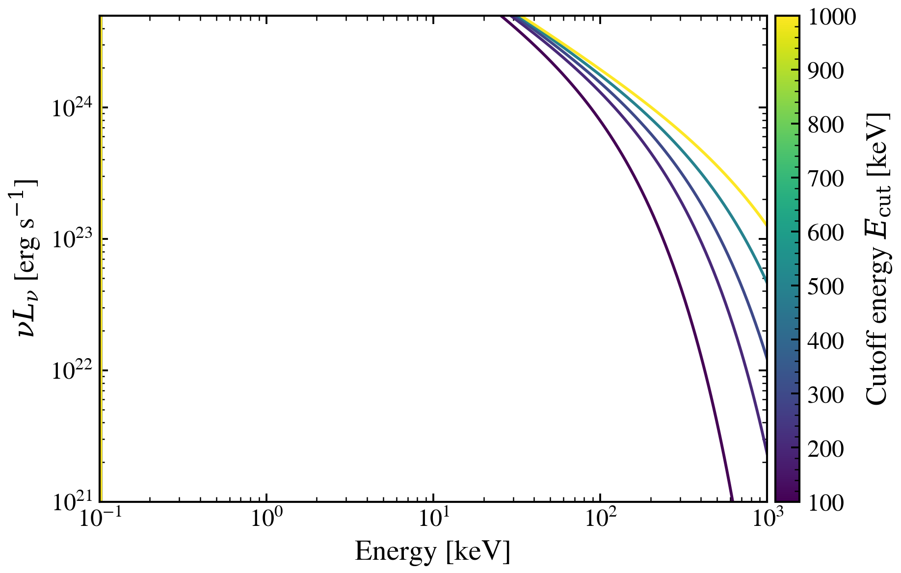

.. DO NOT EDIT.
.. THIS FILE WAS AUTOMATICALLY GENERATED BY SPHINX-GALLERY.
.. TO MAKE CHANGES, EDIT THE SOURCE PYTHON FILE:
.. "auto_examples/xray/plot_E_cut_sweep.py"
.. LINE NUMBERS ARE GIVEN BELOW.

.. only:: html

    .. note::
        :class: sphx-glr-download-link-note

        :ref:`Go to the end <sphx_glr_download_auto_examples_xray_plot_E_cut_sweep.py>`
        to download the full example code.

.. rst-class:: sphx-glr-example-title

.. _sphx_glr_auto_examples_xray_plot_E_cut_sweep.py:

AGN X-ray hard-tail rollover: exponential cutoff E_cut governs high-energy turnover
===================================================================================

The X-ray power-law spectrum steepens above an exponential cutoff E_cut.
Compact coronae with low optical depth have low E_cut (~100 keV); thick,
optically-deep coronae extend to higher E_cut (~1 TeV). Variation of E_cut
at fixed γ=1.8 and α_ox=−1.4 shows how the hard X-ray tail responds to
changes in coronal geometry or magnetic field.

Reference: Wilkins et al. 2020, MNRAS, 493, 5548.

.. GENERATED FROM PYTHON SOURCE LINES 13-56

.. image-sg:: /auto_examples/xray/images/sphx_glr_plot_E_cut_sweep_001.png
   :alt: plot E cut sweep
   :srcset: /auto_examples/xray/images/sphx_glr_plot_E_cut_sweep_001.png
   :class: sphx-glr-single-img

.. code-block:: Python

    import os

    os.environ["TF_CPP_MIN_LOG_LEVEL"] = "2"  # suppress XLA/PjRt C++ INFO+WARNING logs

    import warnings

    import jax.numpy as jnp
    import matplotlib as mpl
    import matplotlib.pyplot as plt
    import numpy as np

    from tengri.analysis.plotting import setup_style
    from tengri.xray import xray_agn_corona

    setup_style()
    warnings.filterwarnings("ignore", message=".*BakedInBackend.*")

    wavelength = jnp.logspace(np.log10(0.0124), np.log10(124.0), 512)
    wave_keV = 12.398 / np.array(wavelength)

    # L_bol = 1e45 erg/s → L_2500 via Hopkins+2007 BC=5.15
    L_2500 = 1.0e45 / (5.15 * 1.199e15)

    ecut_values = np.array([100.0, 200.0, 300.0, 500.0, 1000.0])
    norm = mpl.colors.Normalize(vmin=ecut_values.min(), vmax=ecut_values.max())
    cmap = plt.get_cmap("viridis")

    fig, ax = plt.subplots(figsize=(6.5, 4.2))
    for ecut in ecut_values:
        l_xray = xray_agn_corona(wavelength, l_2500_30deg_erg_hz=L_2500, gamma=1.8, E_cut=float(ecut))
        ax.loglog(wave_keV, np.array(l_xray), lw=1.4, color=cmap(norm(ecut)))

    ax.set_xlim(0.1, 1000)
    ax.set_ylim(1e21, 5e24)
    ax.set_xlabel(r"Energy [keV]")
    ax.set_ylabel(r"$\nu L_\nu$ [erg s$^{-1}$]")

    cbar = fig.colorbar(plt.cm.ScalarMappable(norm=norm, cmap=cmap), ax=ax, pad=0.01)
    cbar.set_label(r"Cutoff energy $E_{\rm cut}$ [keV]")

    fig.tight_layout()
    plt.savefig("plot_E_cut_sweep.png", dpi=150, bbox_inches="tight")

.. _sphx_glr_download_auto_examples_xray_plot_E_cut_sweep.py:

.. only:: html

  .. container:: sphx-glr-footer sphx-glr-footer-example

    .. container:: sphx-glr-download sphx-glr-download-jupyter

      :download:`Download Jupyter notebook: plot_E_cut_sweep.ipynb <plot_E_cut_sweep.ipynb>`

    .. container:: sphx-glr-download sphx-glr-download-python

      :download:`Download Python source code: plot_E_cut_sweep.py <plot_E_cut_sweep.py>`

    .. container:: sphx-glr-download sphx-glr-download-zip

      :download:`Download zipped: plot_E_cut_sweep.zip <plot_E_cut_sweep.zip>`

.. only:: html

 .. rst-class:: sphx-glr-signature

    `Gallery generated by Sphinx-Gallery <https://sphinx-gallery.github.io>`_
