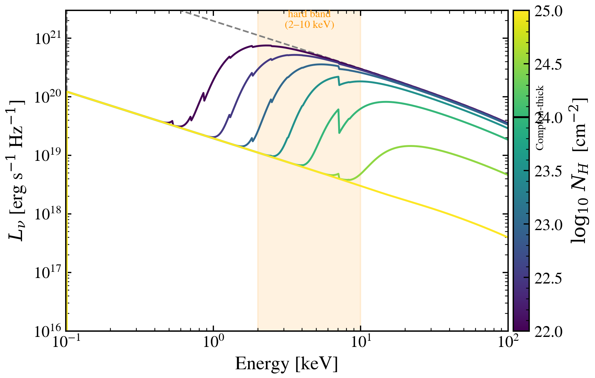

.. DO NOT EDIT.
.. THIS FILE WAS AUTOMATICALLY GENERATED BY SPHINX-GALLERY.
.. TO MAKE CHANGES, EDIT THE SOURCE PYTHON FILE:
.. "auto_examples/xray/plot_compton_thick_vs_thin.py"
.. LINE NUMBERS ARE GIVEN BELOW.

.. only:: html

    .. note::
        :class: sphx-glr-download-link-note

        :ref:`Go to the end <sphx_glr_download_auto_examples_xray_plot_compton_thick_vs_thin.py>`
        to download the full example code.

.. rst-class:: sphx-glr-example-title

.. _sphx_glr_auto_examples_xray_plot_compton_thick_vs_thin.py:

Photoelectric vs. Compton-thick regimes: the N_H = 1e24 cm−2 transition
=========================================================================

X-ray absorption in AGN undergoes a qualitative shift at N_H ≈ 1e24 cm⁻²,
where the cross-section for Compton scattering becomes comparable to
photoelectric absorption. Below this threshold, soft photons (E < 10 keV)
are suppressed by the Thompson cross-section σ_T ≈ 0.66 Barn, creating a
steep spectral curvature in the soft band. Above it, the entire 2–10 keV
continuum is suppressed equally, flattening the spectrum and leaving only
a scattered component (~1% of the intrinsic flux) observable.

This sweep reproduces the regime transition using the absorption model in
Ricci et al. 2017, showing N_H values from 10²² to 10²⁵ cm⁻².

References
----------
- Ricci et al. 2017, Nature 549, 488 (zphabs × cabs model).
- Morrison & McCammon 1983, ApJ 270, 119 (photoelectric cross-sections).
- Raimundo et al. 2012, A&A 537, A21 (Compton-thick AGN).

.. GENERATED FROM PYTHON SOURCE LINES 22-83

.. image-sg:: /auto_examples/xray/images/sphx_glr_plot_compton_thick_vs_thin_001.png
   :alt: plot compton thick vs thin
   :srcset: /auto_examples/xray/images/sphx_glr_plot_compton_thick_vs_thin_001.png
   :class: sphx-glr-single-img

.. code-block:: Python

    import warnings

    import jax.numpy as jnp
    import matplotlib as mpl
    import matplotlib.pyplot as plt
    import numpy as np

    from tengri.analysis.plotting import setup_style
    from tengri.xray import xray_agn_corona

    setup_style()
    warnings.filterwarnings("ignore", message=".*BakedInBackend.*")

    # Wavelength grid: 0.1–100 keV
    wavelength = jnp.logspace(np.log10(0.124), np.log10(124.0), 512)
    wave_keV = 12.398 / np.array(wavelength)

    # Seven N_H values spanning the photoelectric → Compton-thick transition
    log_nh_vals = np.linspace(22.0, 25.0, 7)
    L_2500 = 1e22  # erg/s/Hz — disc at 2500 Å

    fig, ax = plt.subplots(figsize=(6.5, 4.2))
    cmap = plt.get_cmap("viridis")
    norm = mpl.colors.Normalize(vmin=log_nh_vals.min(), vmax=log_nh_vals.max())

    # Intrinsic spectrum (log N_H = 15, unobscured)
    l_intr = np.array(xray_agn_corona(wavelength, l_2500_30deg_erg_hz=L_2500, log_nh=15.0))
    ax.loglog(wave_keV, l_intr, color="0.5", ls="--", lw=1.2, label="intrinsic (N_H=0)")

    # Sweep over N_H
    for log_nh in log_nh_vals:
        l_obs = np.array(xray_agn_corona(wavelength, l_2500_30deg_erg_hz=L_2500, log_nh=log_nh))
        ax.loglog(
            wave_keV,
            l_obs,
            lw=1.4,
            color=cmap(norm(log_nh)),
        )

    # Mark the 2–10 keV band
    ax.axvspan(2.0, 10.0, alpha=0.12, color="C2")
    ax.text(4.5, 1.5e21, "hard band\n(2–10 keV)", fontsize=8, color="C2", ha="center")

    # Annotate Compton-thick boundary on the colorbar (N_H is the sweep, not x)
    # done below after colorbar is created

    ax.set_xlim(0.1, 100)
    ax.set_ylim(1e16, 3e21)
    ax.set_xlabel("Energy [keV]")
    ax.set_ylabel(r"$L_\nu$ [erg s$^{-1}$ Hz$^{-1}$]")

    cbar = fig.colorbar(plt.cm.ScalarMappable(norm=norm, cmap=cmap), ax=ax, pad=0.01)
    cbar.set_label(r"$\log_{10}\,N_H$  [cm$^{-2}$]")
    cbar.ax.axhline(24.0, color="k", lw=1.4)
    cbar.ax.text(
        1.4, 24.0, "Compton-thick", rotation=90, va="center", ha="left", fontsize=8, color="k"
    )

    fig.tight_layout()
    plt.savefig("plot_compton_thick_vs_thin.png", dpi=150, bbox_inches="tight")

.. _sphx_glr_download_auto_examples_xray_plot_compton_thick_vs_thin.py:

.. only:: html

  .. container:: sphx-glr-footer sphx-glr-footer-example

    .. container:: sphx-glr-download sphx-glr-download-jupyter

      :download:`Download Jupyter notebook: plot_compton_thick_vs_thin.ipynb <plot_compton_thick_vs_thin.ipynb>`

    .. container:: sphx-glr-download sphx-glr-download-python

      :download:`Download Python source code: plot_compton_thick_vs_thin.py <plot_compton_thick_vs_thin.py>`

    .. container:: sphx-glr-download sphx-glr-download-zip

      :download:`Download zipped: plot_compton_thick_vs_thin.zip <plot_compton_thick_vs_thin.zip>`

.. only:: html

 .. rst-class:: sphx-glr-signature

    `Gallery generated by Sphinx-Gallery <https://sphinx-gallery.github.io>`_
