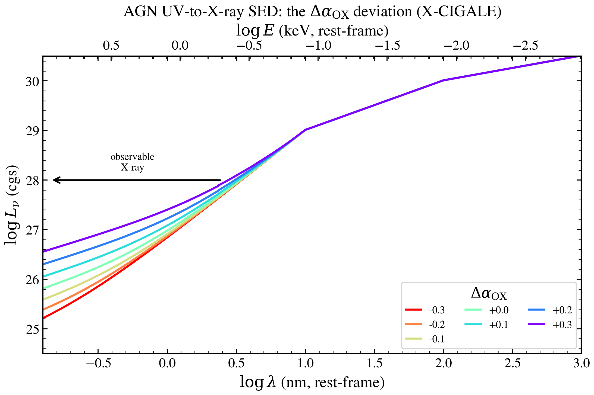

.. DO NOT EDIT.
.. THIS FILE WAS AUTOMATICALLY GENERATED BY SPHINX-GALLERY.
.. TO MAKE CHANGES, EDIT THE SOURCE PYTHON FILE:
.. "auto_examples/xray/plot_xray_delta_alpha_ox_sed.py"
.. LINE NUMBERS ARE GIVEN BELOW.

.. only:: html

    .. note::
        :class: sphx-glr-download-link-note

        :ref:`Go to the end <sphx_glr_download_auto_examples_xray_plot_xray_delta_alpha_ox_sed.py>`
        to download the full example code.

.. rst-class:: sphx-glr-example-title

.. _sphx_glr_auto_examples_xray_plot_xray_delta_alpha_ox_sed.py:

AGN UV-to-X-ray SED: the Δα_OX deviation
========================================

In the X-CIGALE AGN model (Yang et al. 2020) the X-ray corona is tied to the
accretion-disc UV continuum through the α_OX–L_2500 relation. A galaxy-by-galaxy
*deviation* ``Δα_OX`` lets the intrinsic X-ray-to-UV ratio float around that
mean relation: a more positive Δα_OX lifts the X-ray power law relative to the
(fixed) disc, a more negative one suppresses it. Because the disc anchors the
normalisation, all curves pivot at the EUV/soft-X-ray join and overlap redward
of it; only the observable hard-X-ray side fans out.

This sweeps ``delta_alpha_ox`` over [−0.3, +0.3] at fixed disc luminosity,
reproducing the X-CIGALE schematic. The disc is the SKIRTOR intrinsic
accretion-disc continuum scaled so L_ν(2500 Å) = L_2500.

.. GENERATED FROM PYTHON SOURCE LINES 17-91

.. image-sg:: /auto_examples/xray/images/sphx_glr_plot_xray_delta_alpha_ox_sed_001.png
   :alt: AGN UV-to-X-ray SED: the $\Delta\alpha_{\rm OX}$ deviation (X-CIGALE)
   :srcset: /auto_examples/xray/images/sphx_glr_plot_xray_delta_alpha_ox_sed_001.png
   :class: sphx-glr-single-img

.. code-block:: Python

    import os

    os.environ["TF_CPP_MIN_LOG_LEVEL"] = "2"

    import warnings

    import jax.numpy as jnp
    import matplotlib as mpl
    import numpy as np
    from matplotlib import pyplot as plt

    from tengri.analysis.plotting import setup_style
    from tengri.components.agn.disc_cigale import skirtor_disk_spectrum
    from tengri.xray import xray_agn_corona

    setup_style()
    warnings.filterwarnings("ignore", message=".*BakedInBackend.*")

    _C_AA = 2.998e18
    _KEV_AA = 12.398
    _LOG_1P24 = np.log10(_KEV_AA / 10.0)

    # logλ(nm) −0.9 … 3  ⇒  λ_Å = 10^(logλ_nm + 1) = 1.26 … 10000 Å.
    wave_aa = jnp.logspace(np.log10(1.26), np.log10(1.0e4), 700)
    wnp = np.asarray(wave_aa)
    log_nm = np.log10(wnp / 10.0)

    # Disc luminosity anchor.
    _BC_NU = 5.15 * 1.199e15
    L_2500 = 1.0e46 / _BC_NU

    # SKIRTOR intrinsic disc shape (∫ dλ = 1), → L_ν, scaled so L_ν(2500 Å) = L_2500.
    disc_llam = np.asarray(skirtor_disk_spectrum(jnp.asarray(wnp / 10.0), delta=0.0))
    disc_lnu = disc_llam * wnp**2 / _C_AA
    i2500 = int(np.argmin(np.abs(wnp - 2500.0)))
    disc_lnu = disc_lnu * (L_2500 / max(disc_lnu[i2500], 1e-300))

    dax_values = [-0.3, -0.2, -0.1, 0.0, 0.1, 0.2, 0.3]
    # rainbow_r so Δα_OX = −0.3 is red and +0.3 is violet (matches X-CIGALE).
    cmap = plt.get_cmap("rainbow_r")
    norm = mpl.colors.Normalize(vmin=-0.3, vmax=0.3)

    fig, ax = plt.subplots(figsize=(7.6, 5.2))
    for d in dax_values:
        corona = np.asarray(xray_agn_corona(wave_aa, l_2500_30deg_erg_hz=L_2500, delta_alpha_ox=d))
        total = disc_lnu + corona
        ax.plot(
            log_nm,
            np.log10(np.clip(total, 1e-30, None)),
            color=cmap(norm(d)),
            lw=1.8,
            label=f"{d:+.1f}",
        )

    # Observable hard-X-ray window (arrow pointing to short wavelength / high E).
    ax.annotate(
        "", xy=(-0.85, 28.0), xytext=(0.4, 28.0), arrowprops=dict(arrowstyle="->", lw=1.4, color="k")
    )
    ax.text(-0.25, 28.15, "observable\nX-ray", ha="center", va="bottom", fontsize=9)

    ax.set(
        xlim=(-0.9, 3.0),
        ylim=(24.5, 30.5),
        xlabel=r"$\log\lambda$ (nm, rest-frame)",
        ylabel=r"$\log L_\nu$ (cgs)",
    )
    ax_top = ax.secondary_xaxis("top", functions=(lambda x: _LOG_1P24 - x, lambda lk: _LOG_1P24 - lk))
    ax_top.set_xlabel(r"$\log E$ (keV, rest-frame)")

    ax.legend(title=r"$\Delta\alpha_{\rm OX}$", ncol=3, fontsize=9, loc="lower right", frameon=True)
    ax.set_title(r"AGN UV-to-X-ray SED: the $\Delta\alpha_{\rm OX}$ deviation (X-CIGALE)")
    fig.tight_layout()
    plt.savefig("plot_xray_delta_alpha_ox_sed.png", dpi=150, bbox_inches="tight")

.. _sphx_glr_download_auto_examples_xray_plot_xray_delta_alpha_ox_sed.py:

.. only:: html

  .. container:: sphx-glr-footer sphx-glr-footer-example

    .. container:: sphx-glr-download sphx-glr-download-jupyter

      :download:`Download Jupyter notebook: plot_xray_delta_alpha_ox_sed.ipynb <plot_xray_delta_alpha_ox_sed.ipynb>`

    .. container:: sphx-glr-download sphx-glr-download-python

      :download:`Download Python source code: plot_xray_delta_alpha_ox_sed.py <plot_xray_delta_alpha_ox_sed.py>`

    .. container:: sphx-glr-download sphx-glr-download-zip

      :download:`Download zipped: plot_xray_delta_alpha_ox_sed.zip <plot_xray_delta_alpha_ox_sed.zip>`

.. only:: html

 .. rst-class:: sphx-glr-signature

    `Gallery generated by Sphinx-Gallery <https://sphinx-gallery.github.io>`_
