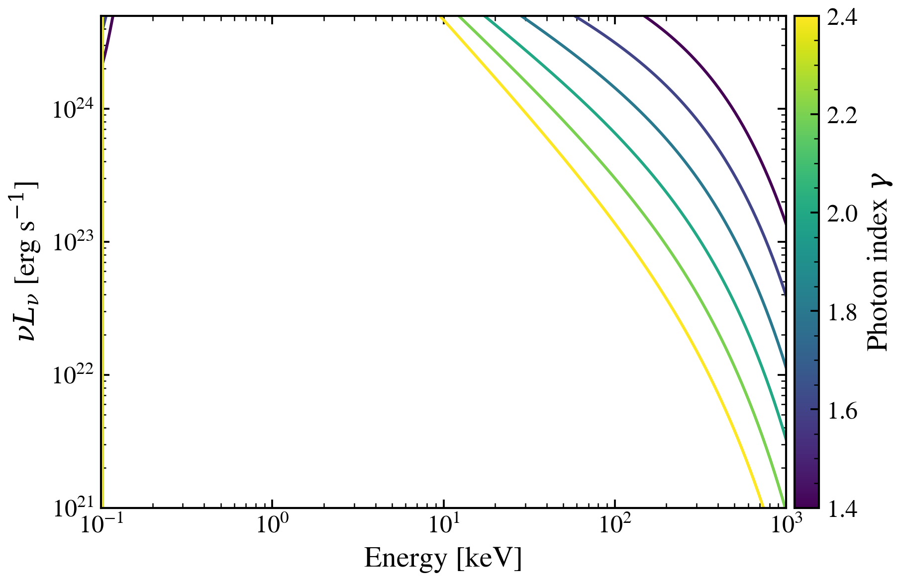

.. DO NOT EDIT.
.. THIS FILE WAS AUTOMATICALLY GENERATED BY SPHINX-GALLERY.
.. TO MAKE CHANGES, EDIT THE SOURCE PYTHON FILE:
.. "auto_examples/xray/plot_xray_gamma_sweep.py"
.. LINE NUMBERS ARE GIVEN BELOW.

.. only:: html

    .. note::
        :class: sphx-glr-download-link-note

        :ref:`Go to the end <sphx_glr_download_auto_examples_xray_plot_xray_gamma_sweep.py>`
        to download the full example code.

.. rst-class:: sphx-glr-example-title

.. _sphx_glr_auto_examples_xray_plot_xray_gamma_sweep.py:

X-ray Spectral Index Variation
===============================

Demonstrates how the photon index (γ) shapes the X-ray continuum.
Sweeps γ ∈ {1.4, 1.6, 1.8, 2.0, 2.2, 2.4} at fixed bolometric luminosity.
Flat spectra (low γ) dominate at low energies; steep spectra (high γ) show rapid decline.

.. sphx-glr-precomputed-img:

.. GENERATED FROM PYTHON SOURCE LINES 16-59

.. code-block:: Python

    import jax.numpy as jnp
    import matplotlib.pyplot as plt
    import numpy as np

    from tengri.analysis.plotting import setup_style
    from tengri.xray import xray_agn_corona

    setup_style()

    # Wavelength grid spans 0.1 keV (124 A) to 1000 keV (0.0124 A).
    # E[keV] = 12.398 / lambda[A].
    wavelength = jnp.logspace(np.log10(0.0124), np.log10(124.0), 512)  # Angstrom
    wave_keV = 12.398 / np.array(wavelength)

    fig, ax = plt.subplots(figsize=(8, 6))

    # Photon index sweep
    gamma_values = [1.4, 1.6, 1.8, 2.0, 2.2, 2.4]
    L_bol = 1e45  # erg/s (fixed)
    n_curves = len(gamma_values)

    colors = plt.cm.viridis(np.linspace(0.0, 0.85, n_curves))

    for gamma, color in zip(gamma_values, colors):
        l_xray = xray_agn_corona(wavelength, L_agn_bol=L_bol, gamma=gamma, E_cut=300.0, alpha_ox=-1.4)
        ax.loglog(wave_keV, np.array(l_xray), lw=2.0, color=color, label=f"γ = {gamma}")

    ax.set_xlabel("Energy [keV]")
    ax.set_ylabel(r"$L_\nu$ [erg s$^{-1}$ Hz$^{-1}$]")
    ax.set_title(
        r"AGN X-ray Corona: Photon Index $\gamma$ Variation"
        "\n"
        r"(L$_{\mathrm{bol}}=10^{45}$ erg/s)"
    )
    ax.set_xlim(0.1, 1000)
    ax.set_ylim(1e21, 5e24)
    ax.legend(fontsize=11, frameon=False)
    ax.grid(True, alpha=0.3, which="both")

    fig.tight_layout()
    plt.savefig("plot_xray_gamma_sweep.png", dpi=150, bbox_inches="tight")
    plt.show()

.. _sphx_glr_download_auto_examples_xray_plot_xray_gamma_sweep.py:

.. only:: html

  .. container:: sphx-glr-footer sphx-glr-footer-example

    .. container:: sphx-glr-download sphx-glr-download-jupyter

      :download:`Download Jupyter notebook: plot_xray_gamma_sweep.ipynb <plot_xray_gamma_sweep.ipynb>`

    .. container:: sphx-glr-download sphx-glr-download-python

      :download:`Download Python source code: plot_xray_gamma_sweep.py <plot_xray_gamma_sweep.py>`

    .. container:: sphx-glr-download sphx-glr-download-zip

      :download:`Download zipped: plot_xray_gamma_sweep.zip <plot_xray_gamma_sweep.zip>`

.. only:: html

 .. rst-class:: sphx-glr-signature

    `Gallery generated by Sphinx-Gallery <https://sphinx-gallery.github.io>`_
