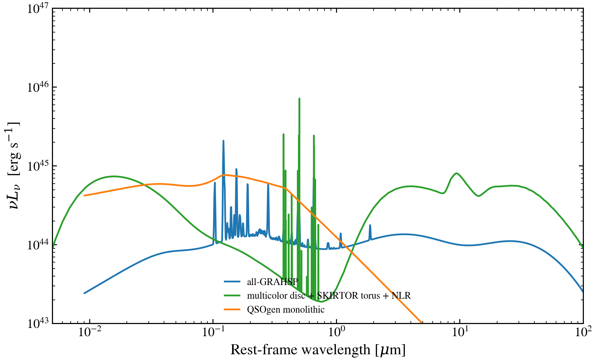
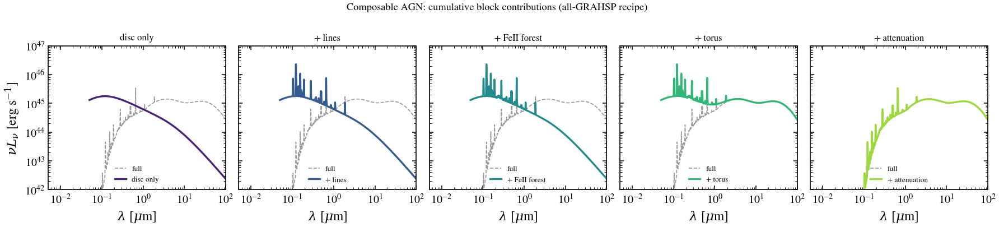

# Three evaluation modes for the SED forward model

> **Stale (2026-05).** The three-mode design space described here has been
> superseded by the current `SEDModelComponent` + `WavePrecomp` pair. See
> [`docs/dev/archive/forward-model-architecture.md`](archive/forward-model-architecture.md)
> for the canonical picture. Kept for historical reference.

Tengri's forward model evaluates every physics component through one of three
modes. The same physics callable can run any of them; the choice is a
workflow trade-off, not a science one.

| Mode | Compile cost | Per-call cost | When to use |
|---|---|---|---|
| **Exact** | None | Full physics (~ms) | Plotting, debugging, mock generation, single-galaxy interactive inspection |
| **JIT-composable** | One-off (per recipe) | One JIT step (~µs–ms) | Catalog fits where the same recipe is reused; gradient-based inference (VI, HMC) |
| **Precompute lookup** | Two-step (grid build + JIT) | Triweight interp (~µs) | Single-galaxy interactive fits with a frozen recipe; nested sampling where compile time dominates |

The same `Parameters` object drives all three modes. Switching modes does not
change the physics; only the numerical precision (precompute lookups are
triweight-interpolated approximations) and the compile/runtime trade.

## Per-layer status

The three-mode pattern is intentionally selective. Cheap inline laws don't
benefit from precompute; expensive tabulated physics does.

| Layer | Exact | JIT-composable | Precompute |
|---|:---:|:---:|:---:|
| Stellar SPS | ✓ | ✓ | ✓ ([`stellar/sps/precompute.py`](../../src/tengri/components/stellar/sps/precompute.py)) |
| Dust attenuation | ✓ | ✓ | n/a (law eval is cheap) |
| Dust emission | ✓ | ✓ | ✓ ([`dust/dust_emission_precompute.py`](../../src/tengri/components/dust/dust_emission_precompute.py)) |
| Nebular | ✓ | ✓ | ✓ (5 backends; see `nebular/*_precompute.py`) |
| AGN monolithic models | ✓ | ✓ | ✓ (per-model `agn/<model>_precompute.py`) |
| AGN composable runner | ✓ | ✓ | ✓ (`agn/blocks/composable_precompute.py`) |
| Radio | ✓ | ✓ | ✓ |
| X-ray | ✓ | ✓ | ✓ |
| IGM | ✓ | ✓ | n/a (transmission is cheap) |

## The `PrecomputeModule` Protocol

Every precompute file in the tree implements the same contract
([`src/tengri/forward/precompute/protocol.py`](../../src/tengri/forward/precompute/protocol.py)):

```python
class PrecomputeModule(Protocol):
    AXIS_PARAMS: tuple[str, ...]
    """Ordered parameter names for grid axes (empty for scalars)."""

    def precompute(filter_waves, filter_trans, redshift, parameters, **kwargs) -> dict:
        """Build a preintegrated grid; auto-collapse Fixed axes."""

    def build_lookup(preint, **kwargs) -> Callable:
        """Return a JIT-compiled (scale, *axis_values) -> photometry callable."""
```

`precompute()` runs at fit setup time (not JIT'd; can do file I/O). It returns
a dict whose `_preint` field holds the triweight grid plus shared edges.
`build_lookup()` wraps the grid in a JIT-compiled lookup whose call cost is
independent of grid size.

The shared helpers
[`precompute_template_photometry`](../../src/tengri/forward/precompute/templates.py)
and `build_template_photometry_lookup` do the heavy lifting; every per-model
precompute file is a thin wrapper that decides axes + collapses Fixed
parameters via [`slice_fixed_axes`](../../src/tengri/utils/grid_interp.py).

## AGN composable example

The composable AGN block subsystem demonstrates all three modes through one
runner. A user composes a recipe out of five pipeline stages —
`disc → lines → feii → torus → attenuation` — picking one of 26 registered
blocks per stage. Two rendered gallery examples cover the surface:

| Gallery entry | Demonstrates |
|---|---|
| [`plot_composable_recipes`](../auto_examples/agn/plot_composable_recipes.html) | Same call site, four different recipe selector tuples (all-GRAHSP, all-QSOgen, GRAHSP BBB + SKIRTOR torus + SMC, multicolor disc + Nenkova). Cross-model mixing in one figure. |
| [`plot_composable_block_toggles`](../auto_examples/agn/plot_composable_block_toggles.html) | Cumulative per-stage breakdown: disc only → + lines → + FeII → + torus → + attenuation. Five side-by-side panels showing which knob controls which spectral feature. |


*Four composable AGN recipes built from the registered block set. Only the
selector strings differ between them — the call site is identical.
([gallery entry](../auto_examples/agn/plot_composable_recipes.html))*


*Cumulative per-block contribution: disc → + lines → + FeII → + torus →
+ attenuation. Each panel adds one pipeline stage to the SED; the dashed
gray curve is the all-blocks-on reference.
([gallery entry](../auto_examples/agn/plot_composable_block_toggles.html))*

### Exact

```python
from tengri.components.agn.blocks import composable_agn_l_nu

L_nu = composable_agn_l_nu(
    wave_aa,
    agn_disc_block="grahsp_sbpl",
    agn_torus_block="skirtor",
    agn_attenuation_block="smc_prevot",
    agn_log_lbol=45.0,
    agn_grahsp_l5100=1e44,
    agn_tau_skirtor=7.0,
    agn_attenuation_ebv=0.1,
)
```

### JIT-composable

```python
import jax

fast = jax.jit(composable_agn_l_nu, static_argnames=(
    "agn_disc_block", "agn_lines_block", "agn_feii_block",
    "agn_torus_block", "agn_attenuation_block",
))
L_nu = fast(wave_aa, ...)  # one-off compile, then ~µs per call
```

### Precompute lookup

```python
from tengri.components.agn.blocks import Recipe
from tengri.components.agn.blocks.composable_precompute import (
    precompute, build_lookup,
)

recipe = Recipe.from_selectors(
    disc="grahsp_sbpl",
    torus="skirtor",
    attenuation="smc_prevot",
    axis_params=("agn_grahsp_l5100",),  # vary this in the fit
)
pre = precompute(
    filter_waves=[filter_wave_aa],
    filter_trans=[filter_transmission],
    redshift=0.0,
    parameters=None,                  # or pass tengri.Parameters for auto-collapse
    recipe=recipe,
    axis_grids={"agn_grahsp_l5100": np.logspace(43, 46, 5)},
)
fn = build_lookup(pre)                # JIT-compiled triweight lookup
photometry = fn(jnp.array(1.0), jnp.array(1e44))  # (n_filters,)
```

### Through the standard `Parameters` API

The above is the low-level entry point. For users running through the
normal tengri inference pipeline, set `agn_axis_grids` on `Parameters`:

```python
from tengri import Parameters

spec = Parameters(
    agn_model="composable",
    agn_disc_block="grahsp_sbpl",
    agn_torus_block="skirtor",
    agn_attenuation_block="smc_prevot",
    agn_log_lbol=Uniform(9.42, 13.42),
    agn_axis_grids={
        "agn_grahsp_l5100": np.logspace(43, 46, 5),
    },
    # ... other free / fixed params ...
)
model = SEDModel(spec, ...)   # precompute fires here, lookup baked in
```

The `SEDModel` constructor builds the lookup at init time and threads it
through the hybrid kernel via
[`PrecomputedData.composable_preintegrated`](../../src/tengri/forward/sed_model_types.py).
Every subsequent likelihood eval is a triweight interp — no recompile, no
template loading inside the JIT trace. The axis values come from the param
dict the inference layer feeds the kernel; multi-axis recipes are supported
(see the benchmark below).

### Benchmarked numbers

From [`bench/scripts/benchmark_composable_precompute.py`](../../bench/scripts/benchmark_composable_precompute.py)
on a template-heavy recipe (GRAHSP BBB + SKIRTOR torus + SMC attenuation; 1500
wavelength points; 1 filter):

| mode | first call | cached | speedup |
|---|---:|---:|---:|
| exact (no JIT) | 1693 ms | 2.6 ms | 1× |
| JIT-composable | 502 ms | 0.35 ms | **7.5×** |
| precompute (build) | 470 ms | — | — |
| precompute (lookup, 1D) | 40 ms | 0.06 ms | **44×** |
| precompute (lookup, 2D 5×5) | 49 ms | 0.09 ms | **31×** |

Numbers will vary by hardware and recipe. The key qualitative pattern:
**precompute compile is ~12× faster than JIT-composable compile**, and the
cached lookup is ~6× faster than the JIT-composable cached call. Multi-axis
precompute scales sub-linearly in the lookup cost (the triweight interp
dominates over the underlying grid size). For template-heavy recipes the
precompute advantage grows; for analytic-only recipes (powerlaw disc + SMC
atten) JIT-composable is competitive.

## When to use which

A practical decision tree:

1. **Just plotting one SED?** → Exact. Don't burn 0.5 s compiling a JIT
   trace for one call.
2. **Fitting a single galaxy with NUTS, < 10 minutes wall-clock?** →
   Precompute. The compile cost dominates; you want minimal trace size.
3. **Fitting a single galaxy with HMC/VI, > 10 minutes wall-clock?** →
   Either works. Precompute is safer if you have template-heavy blocks.
4. **Fitting a catalog with `vmap`?** → JIT-composable. The compile amortizes
   over thousands of galaxies; precompute's triweight error compounds across
   the population.
5. **Posterior-predictive plotting at thousands of posterior draws?** →
   Precompute, then loop the cached lookup.

## Implementation notes

A few constraints to keep in mind when extending the pattern:

- **`__slots__` is incompatible with `jax.jit`-on-instance.** If you wrap a
  JIT callable in a class to expose extra attributes (`axis_names`,
  cache keys, etc.), do **not** declare `__slots__` — JAX uses weakrefs
  internally and `__slots__` blocks them. See `ComposableLookup` in
  [`composable_precompute.py`](../../src/tengri/components/agn/blocks/composable_precompute.py).
- **Static metadata travels via Python attributes.** Recipe selector
  strings, axis names, anything the JIT-traced kernel needs to introspect:
  put it on the lookup-object's `__dict__`, read it at trace-build time,
  use it to bake closures or extract dict keys before the JIT trace runs.
- **Auto-collapse `Fixed` axes early.** When a user pins
  `agn_grahsp_ebv=Fixed(0.1)`, the precompute should drop the corresponding
  axis at construction time via `slice_fixed_axes`, not at runtime. The
  Protocol's `parameters` argument exists for exactly this hook.
