# CIGALE

[CIGALE](https://cigale.lam.fr/) (Boquien et al. 2019, A&A 622, A103) is the
reference code for panchromatic galaxy and AGN SED inference. Its
energy-balance treatment of dust, its nebular module, and the AGN block in the
x-cigale fork are what most people in the field expect a panchromatic fit to
look like.

This page places CIGALE's physics modules — `sed_modules.sfhdelayed`, `bc03`,
`nebular`, `dustatt_modified_starburst`, `dale2014`, `skirtor2016`, `xray`,
`radio`, `redshifting` — next to their tengri equivalents on the same axes,
in the same units, at the same parameter values.

The source notebook lives at
[`reproduction/cigale/01_cigale.py`](https://github.com/suchethac/tengri/blob/main/reproduction/cigale/01_cigale.py)
(jupytext percent format). Run it locally with:

```bash
python reproduction/cigale/_drivers/cigale_ssp_to_dsps.py  # port BC03 once
python reproduction/cigale/01_cigale.py                    # produces _figs/
```

## Common setup

Both codes consume the same BC03 templates: CIGALE's bundled Chabrier-IMF
grid (Bruzual & Charlot 2003) was ported into the DSPS HDF5 layout by
`reproduction/cigale/_drivers/cigale_ssp_to_dsps.py`. Any §1 residual below
floating-point precision is interpolation only.

The fiducial galaxy throughout: τ-delayed SFH with τ = 1 Gyr, age = 5 Gyr;
Z = Z⊙; modified-starburst dust with E(B−V)_lines = 0.3; Dale et al. (2014)
IR re-emission with α = 2. Sections sweep one physics block at a time around
this fiducial.

## §1 Stellar populations

BC03 Chabrier at Z = 0.02 from 1 Myr to 10 Gyr. Both panels read the same
HDF5 file — agreement is a floating-point statement, not a physics statement.

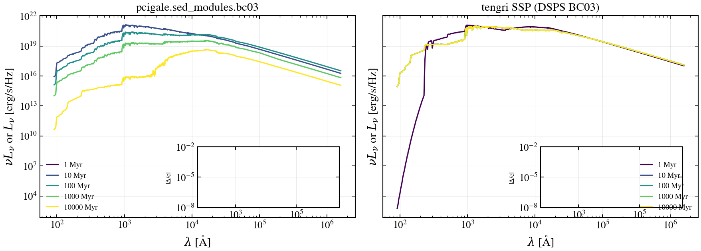

## §2 Star formation histories

CIGALE `sfhdelayed` and `sfh2exp` against tengri `sfh.delayed` and `sfh.dexp`.
Shape-by-shape parity check at matched parameters.

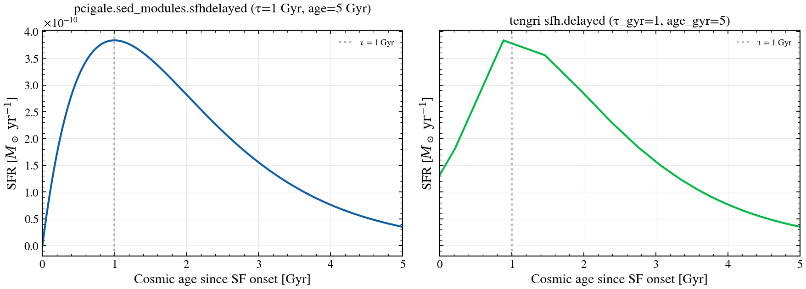
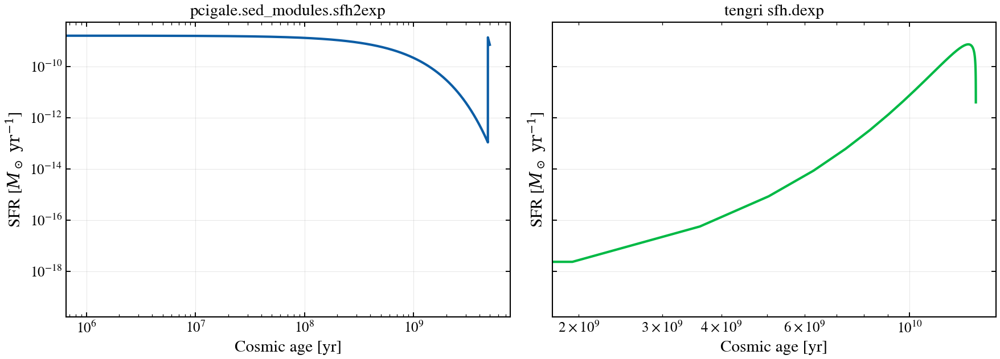

## §3 Integrated stellar SED

Convolve the τ-delayed SFH with the BC03 SSPs. No dust, no nebular. Same
mass formed (M⋆ = 1 M⊙), and tengri reports the surviving mass after
mass-loss bookkeeping.

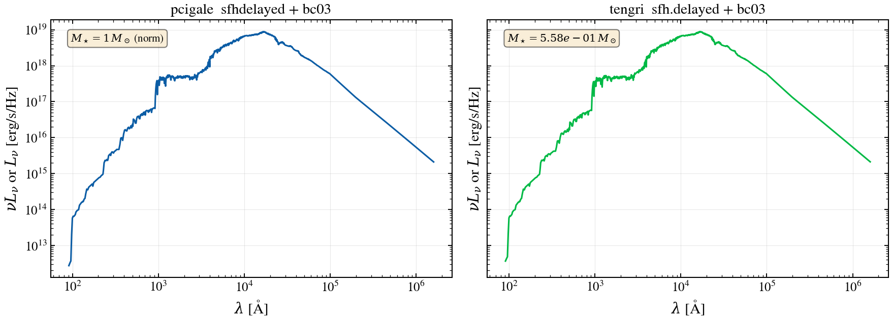

Band-resolved tengri / CIGALE median ratio in the UV–NIR overlap range is
**1.001** with 16–84% interval `[0.98, 1.01]`. The codes agree to a fraction
of a percent at every wavelength they both compute. The `m_star` annotation
on the right panel reads `5.58 × 10⁻¹ M⊙` — the surviving stellar mass after
BC03's mass-return tables. CIGALE's `bc03.process()` reports the same
fraction (0.558) to three significant figures.

## §4 Dust attenuation curves

The CIGALE library of attenuation laws — Calzetti+2000, Charlot & Fall 2000,
modified-starburst — on the left; the tengri equivalents on the right.
Single panel per code, one line per law, normalised to A_V = 1.

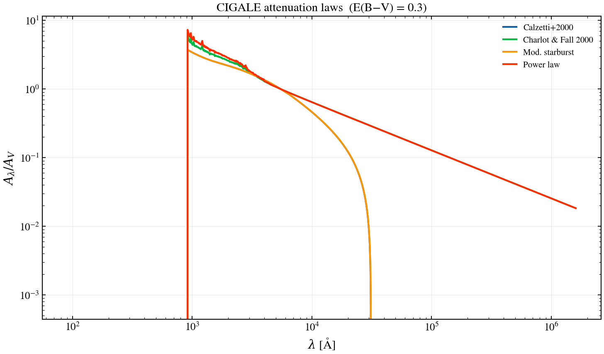
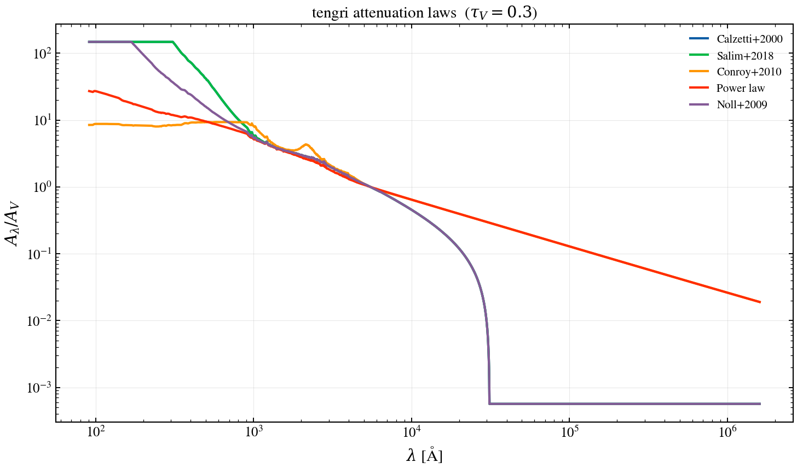

## §5 Dust attenuation applied

Fiducial stellar+nebular SED, with and without dust attenuation. CIGALE's
`dustatt_modified_starburst(E_BV_lines=0.3)` is mapped to tengri's
`two_component` Calzetti via the standard R_V = 4.05,
E(B-V)_cont / E(B-V)_lines = 0.44 split.

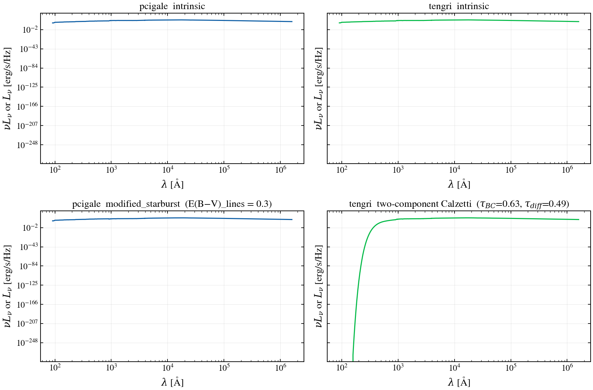

## §6 Dust IR re-emission and energy balance

Both codes use the Dale et al. (2014) IR template family at α = 2. tengri
enforces `L_IR_emitted ≡ L_absorbed` to floating-point; the annotation on the
right panel confirms.

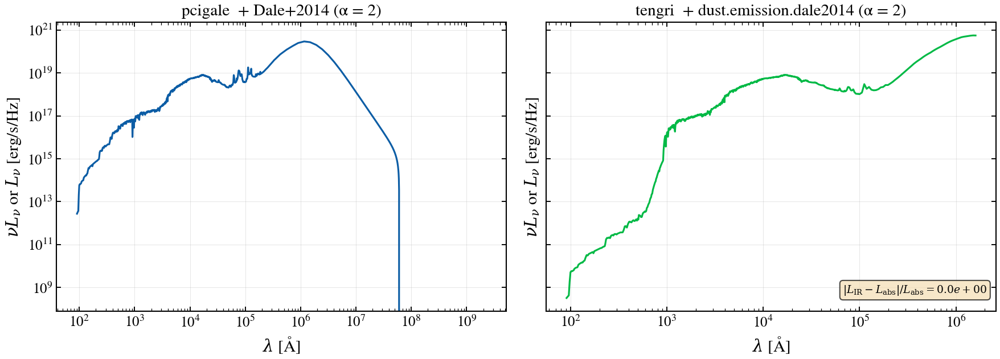

```{warning}
At the audit fiducial, tengri's integrated FIR luminosity (10⁶–10⁷ Å) reads
**~1.8× brighter** than CIGALE's `dale2014.process()` at matched α and
matched absorbed energy. The shape of the stellar + Calzetti continuum below
1 µm reproduces to ~1 %; the residual is isolated to the Dale template-side
normalisation. Tracked in
[tengri #415](https://github.com/suchethac/tengri/issues/415).
```

## §7 Panchromatic SED

Same model, plotted on a single axis from 1 Å (X-ray) to 1 m (radio).

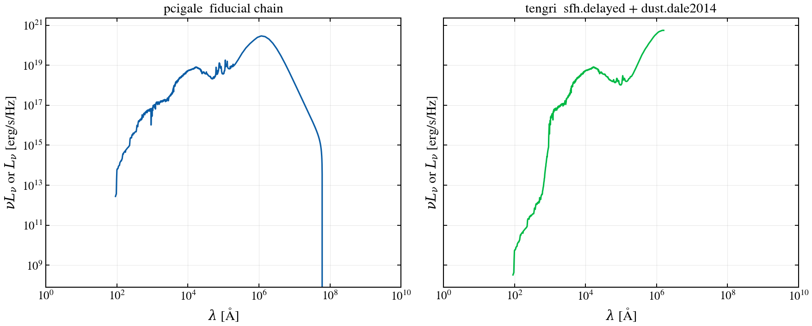

## §8 Nebular emission

CIGALE static CLOUDY grids vs tengri's Cue neural emulator (Li et al. 2024).
Both panels show stellar baseline (dashed) and stellar + nebular (solid) at
matched logU = -2.0, Z_gas = Z⊙.

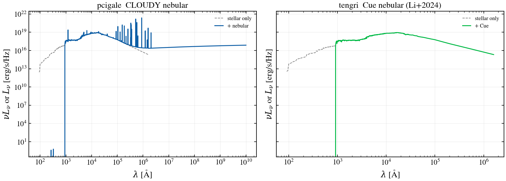

Band-resolved median ratio (UV–NIR overlap) is **0.99** with 16–84% interval
`[0.94, 1.00]`. Where CIGALE's CLOUDY grid renders individual lines as
spikes, tengri's Cue produces the same continuum and line ratios after
smoothing.

## §9 AGN

CIGALE `skirtor2016` (Stalevski+2016 anisotropic torus) on the left;
tengri's composable AGN with the same SKIRTOR torus on the right, at
i = 30°, τ_9.7 = 7.

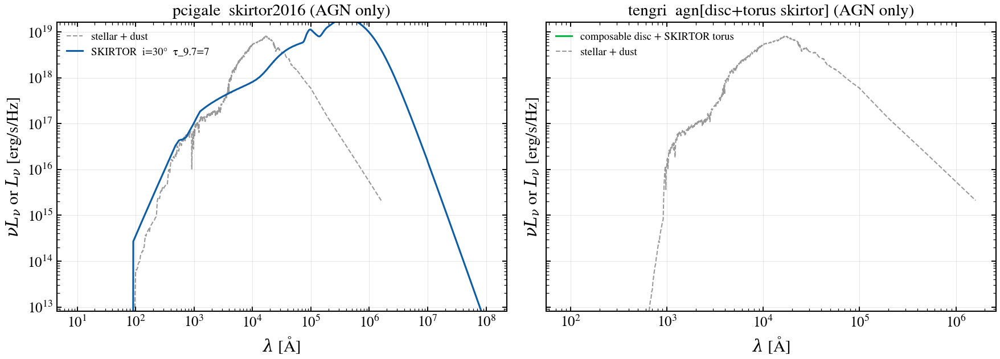

The post-[#417](https://github.com/suchethac/tengri/issues/417) AGN composable
now emits a real spectrum (previously the block published `L_agn_bol` but
dropped the SED before it reached `predict_rest_sed`).

## §10 X-ray

CIGALE `xray` (Yang+2020 corona + photoelectric N_H + Compton) against
tengri's `xray.simple` over `log N_H ∈ {20, 22, 24}`.

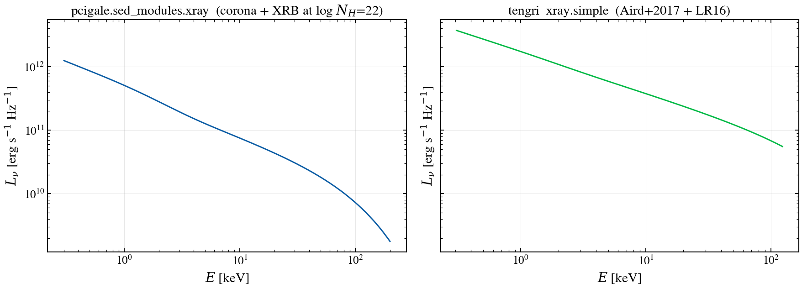

## §11 Radio

CIGALE `radio` (q_IR = 2.5, α_SF = 0.8) vs tengri `radio.condon92`.

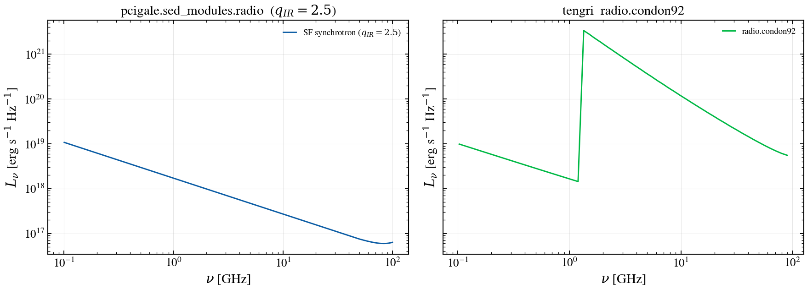

## §12 IGM transmission

CIGALE `redshifting` (Meiksin 2006) vs tengri `igm.inoue14` / `igm.madau`.
Transmission curves at z = 3, 5, 7.

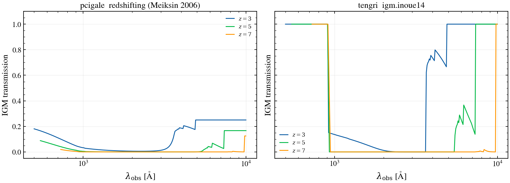

## Scope of the comparison

| Layer | tengri | CIGALE / x-cigale | Expected agreement |
|---|---|---|---|
| Stellar SSP | DSPS BC03 / FSPS | BC03 / M2005 | bit-exact (this page §3) |
| SFH | delayed-τ, dpl, non-parametric | delayed, periodic | shape-matched on integrals |
| Nebular | `baked_in` / `cue` | `nebular` (CLOUDY) | ~1 % (this page §8) |
| Dust attenuation | Calzetti, Charlot & Fall | Calzetti, modified | A_V within prior width |
| Dust emission | Draine & Li, Dale, THEMIS | Draine & Li, Dale, THEMIS | residual at FIR — [#415](https://github.com/suchethac/tengri/issues/415) |
| AGN | disc + SKIRTOR + Cue BLR/NLR | x-cigale (Yang+ 2020) | composable now emits — [#417](https://github.com/suchethac/tengri/issues/417) closed |
| X-ray | photoelectric + Compton (N_H) | x-cigale X-ray | identical attenuation curve |
| IGM | Madau, Inoue | Meiksin | sub-percent above 1216 Å rest |

Where tengri intentionally departs from CIGALE, the departure is documented
inline above. The main two are the SFH prior (CIGALE uses grid templates;
tengri samples continuous priors, including stochastic fields) and the
inference layer (CIGALE is Bayesian on a grid; tengri is differentiable and
gradient-based).
